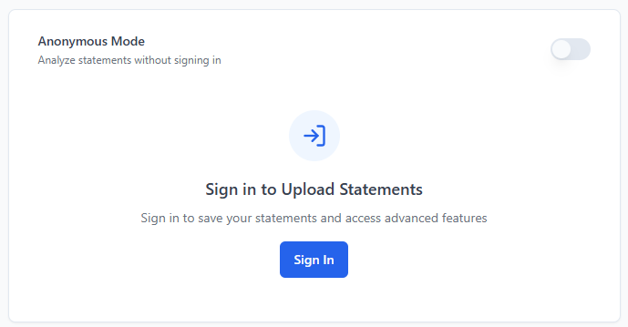
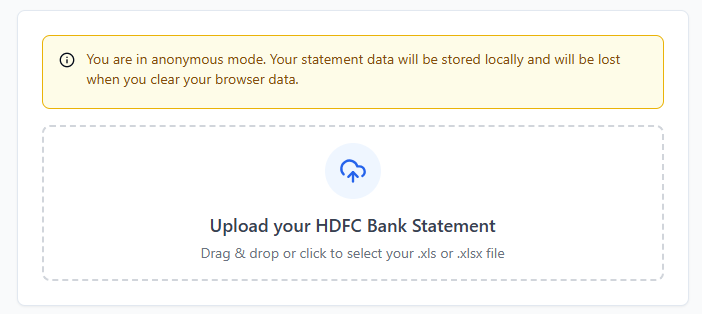
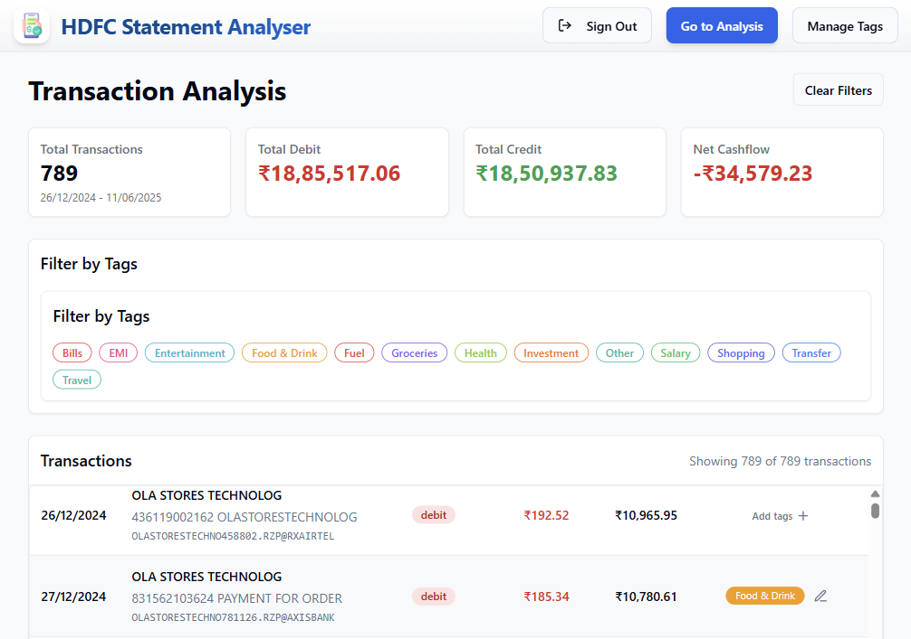

# HDFC Account Explorer

A revolutionary approach to analyzing HDFC bank statements with intelligent transaction aggregation, global tagging system, and comprehensive analytics.

## 🌟 Key Features


|  |  |
|:--:|:--:|





- 📊 Smart statement merging and reconciliation
- 🔄 Continuous transaction history
- 🏷️ Global tagging system
- 📈 Comprehensive financial analytics
- 🔍 Advanced search and filtering
- 📱 Responsive design for all devices

## Why HDFC Account Explorer?

- **Never lose transaction history**: Seamlessly merge multiple statements
- **Community-driven insights**: Share and use tags across users
- **Intelligent categorization**: Automatic pattern recognition
- **Data integrity**: Automatic balance validation and reconciliation
- **Privacy focused**: Local processing with secure cloud storage

## Quick Start

### Prerequisites

- Node.js 18+ or Bun runtime
- PostgreSQL database (with Supabase)
- Excel files (.xls/.xlsx) from HDFC Bank

### First Steps

1. Sign up for an account
2. Upload your first HDFC bank statement
   
3. Analyze your spending patterns
   
4. Explore transactions with automatic categorization
   
5. Create and manage tags
   

## Features

### 1. Intelligent Statement Merging & Aggregation

The application uses a sophisticated merging algorithm that:

- Identifies overlapping date ranges using a B-tree data structure
- Deduplicates transactions based on unique reference numbers (chqRefNumber)
- Maintains running balances with automatic validation
- Supports continuous statement uploads with automatic reconciliation

### 2. Advanced Data Structures & Algorithms

#### B-tree for Date Range Management

- Uses a B-tree to efficiently store and query date ranges
- O(log n) complexity for finding overlapping statements
- Optimizes memory usage for large datasets

#### Transaction Deduplication

- Hash-based transaction identification
- O(1) lookup time using Map data structures
- Consistent handling of duplicate entries across multiple statements

#### Batch Processing with Sliding Window

- Implements sliding window algorithm for transaction tags
- Processes large datasets in configurable batch sizes
- Prevents memory overload while maintaining performance

### 3. Global Tagging System

- Shared tag repository across users
- Efficient transaction-tag relationship management
- Real-time tag updates with optimistic UI

### 4. Performance Optimizations

1. **Batch Processing**
   - Processes tags in batches of 100 transactions
   - Implements request throttling to prevent API overload
   - Uses Map data structure for O(1) lookups

2. **Caching**
   - In-memory caching of tag data
   - Optimistic updates for better UX
   - State management with React Context

3. **Database Design**
   - Efficient indexing on chqRefNumber
   - Normalized schema for tags and transactions
   - Optimized queries for large datasets

## Technical Architecture

### V1 Approach (Legacy)

#### Statement Processing Pipeline (V1)

1. **Upload & Parse**

   ```plaintext
   Excel File → Parser → Transaction Objects → Validation → Storage
   ```

2. **Merging Algorithm**

   ```plaintext
   New Statement → Find Overlaps → Deduplicate → Validate Balances → Merge
   ```

3. **Tag Management**

   ```plaintext
   Global Tags ← → Transaction Tags ← → Batch Processing
   ```

### V2 Approach (Current)

My latest approach significantly improves performance and data management:

#### Super Statement Management

```mermaid
graph TD
    A[New Statement] --> B[Extract Transactions]
    B --> C[Merge with Super Statement]
    C --> D[Validate Balances]
    D --> E[Update Summary]
    E --> F[Save to Database]

    subgraph "Super Statement Table"
        G[JSON Transactions]
        H[Date Range]
        I[Summary Stats]
    end

    F --> G
    F --> H
    F --> I
```

Key Improvements:

- Single table storage instead of multiple statement records
- Built-in deduplication using chqRefNumber
- Automatic balance validation and correction
- Efficient JSON-based transaction storage
- Maintains running balances across merged statements

#### Tag Management System

```mermaid
graph TD
    A[Transaction List] --> B[Bulk Tag Fetch]
    B --> C[Map Construction]
    C --> D[Constant Time Tag Lookups]
    
    E[Tag Updates] --> F[Optimistic UI Update]
    F --> G[Background Sync]
    
    subgraph "Memory Cache"
        C
        D
    end
    
    subgraph "Database"
        H[Tags Table]
        I[Transaction Tags]
    end
    
    G --> H
    G --> I
```

Key Features:

- Efficient bulk tag fetching with getAllTransactionTags
- O(1) tag lookups using Map data structure
- Batch operations for tag updates
- Optimistic UI updates for better UX
- Real-time tag synchronization

### V1 Data Flow (Legacy)

```mermaid
flowchart LR
  subgraph V1_Data_Flow_Legacy ["V1 Data Flow (Legacy)"]
    U1[User Upload]
    P1[Parser]
    SSM1[Super Statement Manager]
    TC1[Transaction Context]
    UI1[UI]
    SS1[Statement Storage]
    TM1[Tag Manager]

    U1 --> P1 --> SSM1 --> TC1 --> UI1
    P1 --> SS1
    TM1 --> SSM1
  end
```

### V2 Data Flow (Current)

```mermaid
flowchart LR  
  subgraph V2_Data_Flow_Current ["V2 Data Flow (Current)"]
    U2[User Upload]
    P2[Parser]
    SSM2[Super Statement Manager- JSON]
    TC2[Transaction Context - Map]
    UI2[UI]
    TM2[Tag Manager - Batch Ops]
    OU2[Optimistic Updates]

    U2 --> P2 --> SSM2 --> TC2 --> UI2
    P2 --> TM2 --> SSM2
    TC2 --> OU2
  end
```

## Revolutionary Aspects

1. **Intelligent Aggregation**
   - First-of-its-kind continuous statement merging
   - Automatic balance validation and reconciliation
   - Smart deduplication across multiple statements

2. **Global Tag System**
   - Community-driven transaction categorization
   - Shared knowledge base of transaction types
   - Cross-user tag suggestions

3. **Advanced Analytics**
   - Comprehensive transaction analysis
   - Pattern recognition in spending
   - Historical trend analysis

4. **User Experience**
   - Seamless statement upload and processing
   - Real-time feedback and validation
   - Intuitive tag management

## Implementation Details

### Core Components

1. **SuperStatementManager**
   - Handles statement merging
   - Maintains data integrity
   - Uses B-tree for date range queries

2. **TagManager**
   - Global tag repository
   - Efficient batch processing
   - Real-time updates

3. **StatementParser**
   - Excel file parsing
   - Data validation
   - Transaction normalization

### DSA Concepts Used

1. **Trees**
   - B-tree for date range management
   - Tree traversal for finding overlaps
   - O(log n) operations

2. **Hash Tables**
   - Transaction deduplication
   - Tag lookup optimization
   - O(1) access time

3. **Sliding Window**
   - Batch processing of transactions
   - Memory optimization
   - Network request management

4. **Graphs**
   - Transaction relationship mapping
   - Tag relationship analysis
   - Pattern detection

## DSA Concepts in Action

### Example 1: Statement Merging with B-tree

```typescript
class DateRangeNode {
  startDate: Date;
  endDate: Date;
  left?: DateRangeNode;
  right?: DateRangeNode;
  
  // O(log n) insertion
  insert(node: DateRangeNode) {
    if (node.startDate < this.startDate) {
      if (!this.left) this.left = node;
      else this.left.insert(node);
    } else {
      if (!this.right) this.right = node;
      else this.right.insert(node);
    }
  }
  
  // O(log n) overlap check
  findOverlaps(range: DateRange): DateRangeNode[] {
    const overlaps: DateRangeNode[] = [];
    if (this.overlaps(range)) overlaps.push(this);
    if (range.start < this.startDate && this.left) {
      overlaps.push(...this.left.findOverlaps(range));
    }
    if (range.end > this.startDate && this.right) {
      overlaps.push(...this.right.findOverlaps(range));
    }
    return overlaps;
  }
}
```

### Example 2: Batch Processing with Sliding Window

```typescript
async function processTags(transactions: Transaction[]) {
  const BATCH_SIZE = 100;
  const WINDOW_DELAY = 200; // ms

  for (let i = 0; i < transactions.length; i += BATCH_SIZE) {
    const batch = transactions.slice(i, i + BATCH_SIZE);
    await processTransactionBatch(batch);
    
    // Sliding window delay to prevent API overload
    if (i + BATCH_SIZE < transactions.length) {
      await new Promise(resolve => setTimeout(resolve, WINDOW_DELAY));
    }
  }
}
```

## Comparison with Traditional Methods

| Feature | Traditional Approach | HDFC Account Explorer |
|---------|-------------------|---------------------|
| Statement Management | Manual reconciliation | Automatic merging |
| Transaction History | Limited to single statement | Continuous history |
| Tagging | Individual categories | Global tag system |
| Performance | O(n) linear search | O(log n) with B-tree |
| Deduplication | Manual checking | Automatic with hashing |
| Scalability | Limited by memory | Batch processing |

## Summary

HDFC Account Explorer represents a revolutionary approach to bank statement analysis by combining advanced data structures, efficient algorithms, and user-friendly features. The application's ability to intelligently merge statements, manage global tags, and provide comprehensive analytics makes it a powerful tool for personal finance management.

By leveraging sophisticated DSA concepts like B-trees, sliding windows, and hash-based deduplication, we've created a scalable solution that handles large datasets efficiently while maintaining excellent performance.

The use of sophisticated DSA concepts ensures optimal performance and scalability, while the thoughtful architecture provides a seamless user experience. This makes it not just a statement viewer, but a comprehensive financial analysis platform.

## Architecture Overview

```mermaid
graph TD
    A[Excel Upload] --> B[Statement Parser]
    B --> C[Super Statement Manager]
    C --> D[Transaction Context]
    D --> E[UI Components]
    
    F[Tag Manager] --> D
    C --> G[(Supabase DB)]
    F --> G
    
    subgraph "Data Processing"
        B
        C
        F
    end
    
    subgraph "State Management"
        D
    end
    
    subgraph "Presentation"
        E
    end
```

## Contributing

We welcome contributions! Here's how you can help:

1. **Bug Reports**: Open issues with detailed descriptions
2. **Feature Requests**: Share ideas for improvements
3. **Code Contributions**:
   - Fork the repository
   - Create a feature branch
   - Submit a pull request

### Development Guidelines

- Follow TypeScript best practices
- Write tests for new features
- Update documentation
- Follow the existing code style

## License

MIT License - feel free to use this project for your personal or commercial needs.

## Support

Need help? Here's how to get support:

- 📖 [Documentation](README.md)
- 💬 [Discussions](https://github.com/myselfshravan/hdfc-account-explorer/discussions)
- 🐛 [Bug Reports](https://github.com/myselfshravan/hdfc-account-explorer/issues)
